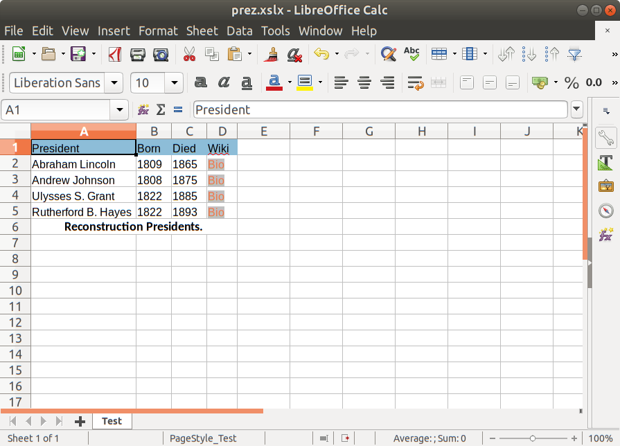

# Office for Clojure
Office for Clojure provides a hiccup-like DSL for MS Office documents.

```clojure
(let [out (new FileOutputStream (new File "/tmp/prez.xslx"))
      wb (excel
          [:wb
           [:table {:title "Test"}
            [:thead
             [:tr {:background-color "#8DBDD8"}
              [:td "President"]
              [:td "Born"]
              [:td "Died"]
              [:td "Wiki"]]]
            [:tbody 
             [:tr [:td "Abraham Lincoln"]
              [:td "1809"]
              [:td "1865"]
              [:td [:a {:href "https://en.wikipedia.org/wiki/Abraham_Lincoln"} "Bio"]]]
             [:tr
              [:td "Andrew Johnson"]
              [:td "1808"]
              [:td "1875"]
              [:td [:a {:href "https://en.wikipedia.org/wiki/Andrew_Johnson"} "Bio"]]]
             [:tr
              [:td "Ulysses S. Grant"]
              [:td "1822"]
              [:td "1885"]
              [:td
               [:a {:href "https://en.wikipedia.org/wiki/Ulysses_S._Grant"} "Bio"]]]
             [:tr
              [:td "Rutherford B. Hayes"]
              [:td "1822"]
              [:td "1893"]
              [:td [:a {:href "https://en.wikipedia.org/wiki/Rutherford_B._Hayes"} "Bio"]]]]
            [:tfoot
             [:tr [:td {:colspan "4"} "Reconstruction Presidents."]]]]])]
  (.write wb out)
  (.close out))
```

